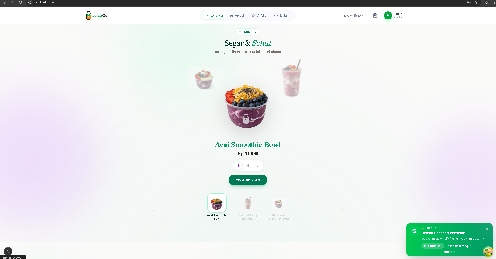
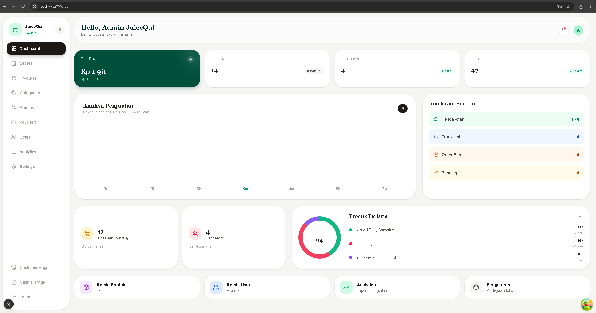
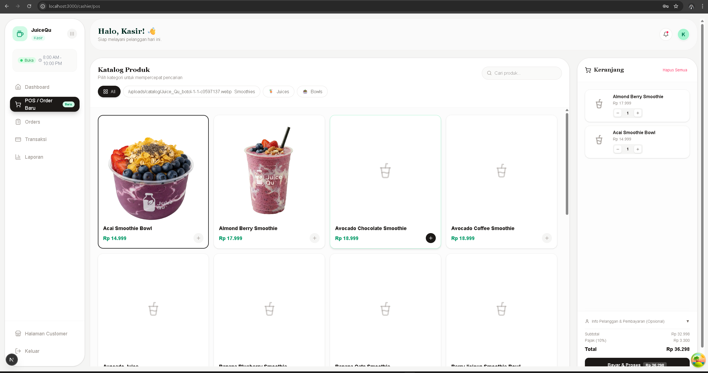

# JuiceQu

A modern e-commerce platform for juice shops with AI-powered ordering, voice commands, and multi-role management system.

## Table of Contents

- [Overview](#overview)
- [Features](#features)
- [Tech Stack](#tech-stack)
- [Project Structure](#project-structure)
- [Getting Started](#getting-started)
- [Usage Guide](#usage-guide)
- [Team](#team)
- [Contributing](#contributing)
- [License](#license)

---

## Overview

JuiceQu is a full-stack e-commerce solution designed for juice shops. It provides three user roles (Customer, Cashier, Admin) with AI-powered features including:

- Natural language chatbot for product inquiries and ordering
- Voice ordering with multi-language support (Indonesian, English, Javanese, Sundanese)
- AI-powered product recommendations
- Pre-order scheduling system

**docs**: [https://juicequ.app/docs](https://juicequ.app/docs)
**Live Demo**: [https://juicequ.app](https://juicequ.app)

---

## Gallery

<div align="center">
  <h3>Customer Interface</h3>
  
  
  <div style="display: flex; justify-content: center; gap: 20px; margin-top: 20px;">
    <div>
      <h3>Admin Dashboard</h3>
      
    </div>
    <div>
      <h3>Cashier POS</h3>
      
    </div>
  </div>
</div>

---

## Features

### Customer Features
- Browse and search products with filters
- AI Chatbot for product questions, nutrition info, and recommendations
- Voice ordering with natural language processing
- Shopping cart and checkout with voucher support
- Pre-order scheduling (1-7 days ahead)
- Order history tracking
- Multi-language interface (ID, EN, JV, SU)
- Multi-currency display (IDR, USD)

### Cashier Features
- Point of Sale (POS) interface
- Daily sales reports
- Transaction management
- Order status updates

### Admin Features
- Product and category management
- User role management (admin, cashier, customer)
- Voucher and promotion management
- Store settings (operating hours, payment methods)
- Analytics dashboard

### AI System
The application uses a Multi-Agent RAG (Retrieval-Augmented Generation) architecture:

| Agent | Purpose |
|-------|---------|
| Intent Router | Classifies user intent and routes to appropriate agent |
| Product Agent | Handles product info, recommendations, nutrition queries |
| Order Agent | Processes cart operations and order placement |
| Navigation Agent | Guides users to relevant pages |
| Guard Agent | Maintains context within juicequ domain |

---

## Tech Stack

| Component | Technology |
|-----------|------------|
| Frontend | Next.js 16, TypeScript, Tailwind CSS, Zustand |
| Backend | Python 3.11+, FastAPI, SQLAlchemy, Pydantic |
| Database | PostgreSQL (production), SQLite (development) |
| AI/LLM | Kolosal AI API, Google Gemini |
| Vector DB | ChromaDB |
| Voice | Google Cloud Speech-to-Text(optional), webkitSpeechRecognition |
| Auth | JWT, Google OAuth 2.0 |
| Container | Docker, Docker Compose |
| Deployment | VPS with Docker Compose |
| CI/CD | GitHub Actions |

---

## Project Structure

```
juicequ/
├── backend/                      # FastAPI Backend
│   ├── app/
│   │   ├── api/v1/endpoints/    # REST API endpoints
│   │   │   ├── admin/           # Admin routes
│   │   │   ├── cashier/         # Cashier routes
│   │   │   └── customer/        # Customer routes
│   │   ├── core/                # Config, auth, middleware
│   │   ├── db/                  # Database setup
│   │   ├── models/              # SQLAlchemy models
│   │   ├── schemas/             # Pydantic schemas
│   │   └── services/            # Business logic
│   │       └── ai/              # AI services
│   │           ├── agents/      # Multi-agent system
│   │           ├── rag_service.py
│   │           └── stt_service.py
│   ├── alembic/                 # Database migrations
│   ├── Dockerfile
│   └── requirements.txt
│
├── frontend/                     # Next.js Frontend
│   └── src/
│       ├── app/                 # App Router pages
│       │   ├── admin/           # Admin pages
│       │   ├── cashier/         # Cashier pages
│       │   ├── cart/            # Shopping cart
│       │   ├── checkout/        # Checkout flow
│       │   ├── menu/            # Product listing
│       │   ├── orders/          # Order history
│       │   └── profile/         # User profile
│       ├── components/          # React components
│       │   ├── admin/           # Admin components
│       │   ├── layout/          # Header, Footer, etc
│       │   ├── products/        # Product cards, filters
│       │   └── ui/              # Reusable UI components
│       ├── lib/                 # Utilities
│       │   ├── api/             # API client modules
│       │   ├── hooks/           # Custom React hooks
│       │   └── store.ts         # Zustand stores
│       └── locales/             # i18n translations
│
├── docs/                        # Documentation
│   └── VPS_DEPLOYMENT.md        # VPS deployment guide
├── scripts/                     # Utility scripts
├── .github/workflows/           # CI/CD pipelines
├── docker-compose.yml           # Docker orchestration
├── .env.example                 # Environment template
└── README.md
```

---

## Getting Started

### Prerequisites

- Python 3.11+
- Node.js 20+
- PostgreSQL 15+ (or SQLite for development)
- Kolosal AI API key
- (Optional) Google Cloud credentials for Speech-to-Text

### Installation

**1. Clone the repository**

```bash
git clone https://github.com/mycoderisyad/juicequ.git
cd juicequ
```

**2. Backend Setup**

```bash
cd backend

# Create virtual environment
python -m venv venv

# Activate (Windows)
.\venv\Scripts\Activate.ps1

# Activate (Linux/Mac)
source venv/bin/activate

# Install dependencies
pip install -r requirements.txt

# Configure environment
cp .env.example .env
# Edit .env with your API keys

# Run migrations
alembic upgrade head

# Start server
uvicorn app.main:app --reload --port 8000
```

Backend runs at: http://localhost:8000
API Docs: http://localhost:8000/docs

**3. Frontend Setup**

```bash
cd frontend

# Install dependencies
npm install

# Configure environment
cp .env.example .env.local
# Edit .env.local

# Start development server
npm run dev
```

Frontend runs at: http://localhost:3000

**4. Docker Compose**

```bash
# Copy environment file
cp .env.example .env
# Edit .env with your configuration

# Start all services
docker-compose up -d

# Run migrations
docker-compose exec backend alembic upgrade head
```

## Usage Guide

### For Customers

1. Visit the homepage and browse the menu
2. Use the chatbot (bottom-right) to ask about products
3. Click the microphone icon for voice ordering
4. Add items to cart and proceed to checkout
5. Apply voucher codes if available
6. Schedule pre-orders for future pickup

### For Cashiers

1. Login with cashier credentials
2. Access POS at `/cashier/pos`
3. Process orders using voice or manual input
4. View daily reports at `/cashier/reports`

### For Admins

1. Login with admin credentials
2. Access dashboard at `/admin`
3. Manage products, categories, and users
4. Configure store settings and promotions
5. Monitor analytics

### Voice/Chat Commands

| Command | Action |
|---------|--------|
| "Show menu" | Navigate to menu page |
| "Recommend fresh juice" | Get product recommendations |
| "Add Berry Blast to cart" | Add item to cart |
| "What's popular?" | Show bestsellers |
| "Checkout" | Go to checkout |


## Contributing

1. Fork the repository
2. Create feature branch: `git checkout -b feature/my-feature`
3. Commit changes: `git commit -m "feat: add feature"`
4. Push to branch: `git push origin feature/my-feature`
5. Open a Pull Request

### Commit Convention

Use [Conventional Commits](https://conventionalcommits.org):

| Prefix | Usage |
|--------|-------|
| feat: | New feature |
| fix: | Bug fix |
| docs: | Documentation |
| refactor: | Code refactoring |
| test: | Tests |

---

## Team

**Team Name**: Kata mamah gak boleh aneh-aneh

**Hackathon**: IMPHNEN X KOLOSAL AI

**Members**:
- **Raflan** - Full Stack Developer
- **Sasya** - Product Designer
- **Fauzan** - Product Manager

---

## License

MIT License - see [LICENSE](./LICENSE)

---

**Live Demo**: [https://juicequ.app](https://juicequ.app)
